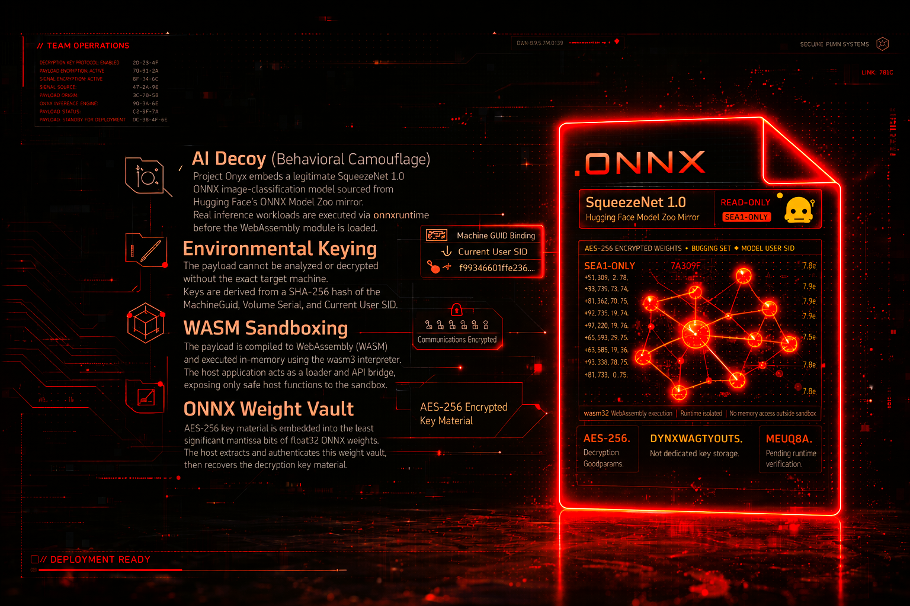
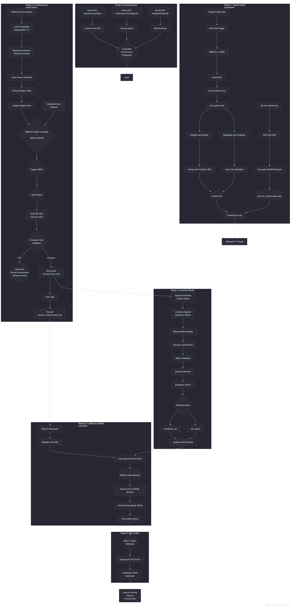

# Project Onyx
Advanced EDR Evasion via AI Telemetry Spoofing & WASM Sandboxing. Project Onyx is a PoC Red Team pipeline designed to demonstrate advanced evasion techniques against modern EDR systems. It shifts away from traditional signature-based obfuscation towards behavioral camouflage and strict environmental keying.

This Project is proof-of-concept red team research, studying an 
unconventional multi-layer execution pipeline. The architecture chains five 
distinct techniques: AI telemetry camouflage, hardware-bound environment 
keying, ONNX weight steganography, in-memory WebAssembly sandboxing and Dead-Drop C2 via downlink model updates --> into a single functional delivery chain.

Project Onyx does not claim a working bypass of production EDR systems. It is an architectural sketch: each component is implemented and functional as part of the chain, but each layer would require dedicated research to become meaningful against real-world defenses.Project Onyx is best understood as a structured starting point for that kind of exploration.
The runtime payload is intentionally limited to a heartbeat beacon, allowing the full pipeline to be examined without shipping destructive or post-exploitation behavior. 

## Core Concepts / UPDATE = Project Onyx v2

1. **AI Decoy (Behavioral Camouflage):** Now, Project Onyx embeds a legitimate SqueezeNet 1.0 ONNX image-classification model sourced from Hugging Face's ONNX Model Zoo mirror. Before the WebAssembly heartbeat module is executed, the host runs repeated real tensor inference workloads using Microsoft's `onnxruntime`. This makes the ONNX artifact an active part of the pipeline rather than a decorative file like previous tiny MLP.
2. **Environmental Keying:** It significantly raises the bar for sandbox analysis and reverse engineering without access to the exact target machine. The decryption keys are dynamically derived from the SHA-256 hash of the target's `MachineGuid`, `Volume Serial Number`, and the `current user's SID`.
3. **WASM Sandboxing:** The actual payload is compiled to WebAssembly (WASM) and executed entirely in-memory using the `wasm3` interpreter. The host C++ application acts merely as a loader and API bridge, exposing safe host functions to the WASM sandbox.
4. **ONNX Weight Vault:** The AES-256 key material required to decrypt the WebAssembly heartbeat module is embedded into the least significant mantissa bits of `float32` ONNX weights. The host extracts this weight vault from the embedded model bytes, authenticates it, and only then recovers the demo key material. 
5. **Metadata Vault Fallback:** The original authenticated metadata vault remains for compatibility and build-time verification. New assets prefer the weight vault, while the metadata vault documents the same protected material in a more inspectable form.
6. **Dead-Drop C2 via downlink model updates:** The pipeline demonstrates a covert communication channel using ONNX model updates. An operator can embed an authenticated directive inside the LSBs of weights that have naturally changed during fine-tuning. These changes are identified via delta analysis between the updated model and the reference (base) model. To maintain a safe PoC scope, the runtime strictly accepts only `heartbeat_ack` and `set_status` directives, demonstrating channel viability without enabling arbitrary command execution.



## Highly Recommended

See `docs/architecture.md` for the FULL end-to-end technical sketch. (I recommend, for better understanding).

and also the entire process: my mistakes, the concepts and ideas I considered along the way, and the architectural tradeoffs I faced while building Project Onyx --> [Medium](https://medium.com/@X-3306/shifting-the-edr-evasion-angle-from-signature-obfuscation-to-behavioral-camouflage-9b7ec93766f6)

## Legal Disclaimer

This project is created solely for educational purposes, security research, and authorized Red Team operations. 

The techniques demonstrated in this repository (Project Onyx) are intended to help security professionals understand advanced evasion methods and improve endpoint defenses (EDR/XDR). 

**Do not use this software on any system or network that you do not own or have explicit, written permission to test.**

The author of this project (X-3306) assume no liability and are not responsible for any misuse, damage, or illegal activities caused by the use of this software. By downloading, compiling, or using this code, you agree to take full responsibility for your actions.

## Repository Layout

- `DiagnosticsTool.cpp` - C++ Windows host and Wasm3/ONNX integration.
- `DiagnosticsTool.rc` / `resource.h` - resource bindings for generated assets.
- `build.py` - helper for fingerprinting, ONNX bait generation, weight-vault embedding, metadata-vault compatibility, Dead-Drop C2 via downlink model updates, and WASM encryption.
- `wasm_license_module/` - Rust source for the WebAssembly heartbeat module.
- `wasm3/source/` - minimal vendored Wasm3 source required by the CMake build.
- `assets/README2.md` - generated asset formats.
- `docs/architecture.md` - full runtime chain and architecture notes.

## Prerequisites

Install these on Windows before building:

- Visual Studio 2022 with Desktop development with C++.
- CMake 3.25 or newer.
- Python 3.10 or newer.
- Rustup and Cargo.
- Git.

Python dependencies:

```powershell
py -m pip install onnx numpy cryptography
```

Rust target:

```powershell
rustup target add wasm32-unknown-unknown
```

## ONNX Runtime Static Build

The CMake file expects an ONNX Runtime source/build tree at `./onnxruntime` and
links the static component libraries from:

- `onnxruntime/build/Windows/Release/Release`
- `onnxruntime/build/Windows/Release/vcpkg_installed/x64-windows-static-md/lib`

From a Developer PowerShell for VS 2022, build ONNX Runtime like this:

```powershell
git clone --recursive https://github.com/microsoft/onnxruntime.git onnxruntime
.\onnxruntime\build.bat --config Release --parallel --compile_no_warning_as_error --skip_tests --build_shared_lib --use_vcpkg --cmake_extra_defines VCPKG_TARGET_TRIPLET=x64-windows-static-md onnxruntime_BUILD_UNIT_TESTS=OFF
```

The generated `onnxruntime.dll` is not shipped with Project Onyx. Project Onyx
links the static component `.lib` files and the final executable should not list
`onnxruntime.dll` in `dumpbin /DEPENDENTS`.

## Generate Assets

Get the fingerprint hash for the current Windows device:

```powershell
python build.py fingerprint --show-components
```

Use the second printed line as the `--trigger` value.

Build the Rust WebAssembly module:

```powershell
cargo build --manifest-path wasm_license_module/Cargo.toml --target wasm32-unknown-unknown --release
```

Generate `assets/model.onnx` and `assets/license_module.wasm.aes`:

```powershell
python build.py build `
  --trigger "<64-char lowercase fingerprint hash>" `
  --secret "<exactly-32-demo-key-chars>" `
  --model-output assets/model.onnx `
  --wasm-input wasm_license_module/target/wasm32-unknown-unknown/release/wasm_license_module.wasm `
  --wasm-output assets/license_module.wasm.aes
```

Verify the ONNX vaults:

```powershell
python build.py verify --trigger "<64-char lowercase fingerprint hash>" --model assets/model.onnx
```

The verification command checks both the legacy metadata vault and the hidden
ONNX weight vault. Both must unlock the same 32-character demo key material.

## Real ONNX Model

The default carrier is SqueezeNet 1.0 opset 12:

- source: `onnxmodelzoo/squeezenet1.0-12`
- file: `assets/base/squeezenet1.0-12.onnx`
- license: Apache-2.0 on the Hugging Face model card
- input: `data_0`, `float[1, 3, 224, 224]`
- output: `softmaxout_1`, `float[1, 1000, 1, 1]`
- size: about 4.95 MB
- float32 weights: about 1.23 million

Fetch or verify the bundled base model:

```powershell
python build.py fetch-model
```

`build.py build` copies this real model, adds Project Onyx metadata, embeds the
authenticated ONNX weight vault into its `float32` initializer LSBs, and writes
the final reference model to `assets/model.onnx`.

## Heartbeat-Only Dead-Drop C2 via Model Update Downlink

The additional downlink is a research extension for testing whether a normal ONNX
model update can carry an authenticated, tiny control signal as a simple PoC. It
is deliberately limited to two safe directives:

- `heartbeat_ack` - changes the runtime heartbeat status to `heartbeat_ack`.
- `set_status` - changes the runtime heartbeat status to an operator-chosen safe
  string such as `lab_downlink_ack`.

Create a lab update model:

```powershell
python build.py downlink-build `
  --trigger "<64-char lowercase fingerprint hash>" `
  --reference-model assets/model.onnx `
  --output assets/downlink_update.onnx `
  --command set_status `
  --status lab_C2_test `
  --expires-unix 4102444800 `
  --cover-seed 2026 `
  --cover-fraction 0.08 `
  --cover-noise-scale 0.00004
```

Verify it before use:

```powershell
python build.py downlink-verify `
  --trigger "<64-char lowercase fingerprint hash>" `
  --reference-model assets/model.onnx `
  --model assets/downlink_update.onnx
```


## Webhook & Model Configuration

Point it at a raw HTTPS model artifact, for example a public release asset:

```powershell
$env:PROJECT_ONYX_DOWNLINK_MODEL_URL = "https://huggingface.co/<profile>/<repo>/resolve/main/downlink_update.onnx"
.\build\Release\ProjectOnyx.exe
```
Or use webhook Slack/Teams: 

Project Onyx does not embed a real webhook URL. For authorized lab runs, set:

The variable must be visible to the process that starts `ProjectOnyx.exe`. If
you double-click the executable, set it as a user or system environment variable
first, then open a new terminal or restart Explorer And run the native host with a local update model:

```powershell
$env:PROJECT_ONYX_DOWNLINK_MODEL_PATH = "$($PWD.Path)\assets\downlink_update.onnx"; $env:PROJECT_ONYX_SLACK_WEBHOOK_URL = "https://hooks.slack.com/services/..."; .\build\Release\ProjectOnyx.exe
```
(You can also use Teams)

The runtime performs one fetch/read at startup. It does not poll, persist,
execute downloaded code, or process arbitrary commands. Invalid, expired,
unrelated, or unauthenticated model updates are ignored.

Runtime verification knobs:

```powershell
$env:PROJECT_ONYX_ONNX_TELEMETRY_PASSES = "24"
$env:PROJECT_ONYX_REQUIRE_ONNX_TELEMETRY = "1"
$env:PROJECT_ONYX_LAB_OUTPUT_PATH = "$($PWD.Path)\assets\lab_heartbeat.json"
```

### IMPORTANT, Pls Read: Reference Model, Fine-Tuning, and Natural Deltas

`PROJECT_ONYX_ONNX_TELEMETRY_PASSES` controls how many real ONNX Runtime
inferences run before the vault unlock path continues. `PROJECT_ONYX_REQUIRE_ONNX_TELEMETRY=1`
turns telemetry failures into hard failures, which is useful when validating
that the ONNX stage is not being skipped. `PROJECT_ONYX_LAB_OUTPUT_PATH` writes
the final heartbeat JSON to a local file for lab verification without requiring
a webhook.

This repository ships a real SqueezeNet reference model because it is small
enough for GitHub while still being a legitimate trained neural network. For a
stronger research artifact, create an updated model through real fine-tuning or
another normal model-maintenance process. The downlink embedder can then
restrict its bit changes to weights that already changed relative to the
reference model. That is the practical version of "hide inside fine-tuning
noise" idea, link to full side-project: https://github.com/X-3306/ONNXStego

For quick lab validation, `downlink-build` can synthesize a seeded random
fine-tuning-like cover update from the reference model. That proves the
end-to-end mechanics and gives natural candidate weights for the LSB record, BUT
it is NOT a substitute for empirical evaluation on a real task, dataset, and
fine-tuning procedure.

## Final Build

Configure and build the release executable:

```powershell
cmake -S . -B build -G "Visual Studio 17 2022" -A x64
cmake --build build --config Release
```

The final executable is:

```text
build\Release\ProjectOnyx.exe
```

Optional dependency check:

```powershell
& "C:\Program Files\Microsoft Visual Studio\2022\Community\VC\Tools\MSVC\14.44.35207\bin\Hostx64\x64\dumpbin.exe" /DEPENDENTS build\Release\ProjectOnyx.exe
```

Expected: no `onnxruntime.dll` dependency.

## Scope

The demo does not include persistence, privilege escalation, credential access,
lateral movement, arbitrary command execution, destructive behavior, or bundled
private webhook tokens. The WebAssembly module is constrained to formatting and
returning a heartbeat JSON as a simple PoC. The additional model-update downlink
can only alter that heartbeat status through the `heartbeat_ack` / `set_status`
whitelist. If you have some interesting ideas for this project, feel free to contact: X3306.Business@proton.me

<p align="center">
  <a href="https://trendshift.io/repositories/37934?utm_source=trendshift-badge&amp;utm_medium=badge&amp;utm_campaign=badge-trendshift-37934" target="_blank" rel="noopener noreferrer">
    
  </a>
  <a href="https://trendshift.io/repositories/37934?utm_source=trendshift-badge&amp;utm_medium=badge&amp;utm_campaign=badge-trendshift-37934" target="_blank" rel="noopener noreferrer">
    
  </a>
</p>
