# Project Onyx Architecture

Project Onyx is a red team research PoC that demonstrates a layered runtime
composition pattern:

1. derive a local Windows environment fingerprint
2. load an embedded real SqueezeNet ONNX model from the executable resource section
3. run repeated ONNX Runtime image-classification workloads as a benign bait computation
4. unlock authenticated key material hidden in ONNX `float32` weight LSBs
5. fall back to the authenticated ONNX metadata vault for compatibility
6. optionally read one authenticated ONNX model-update downlink (PoC of Dead-Drop C2)
7. apply only a heartbeat/status directive from a strict whitelist
8. use the recovered demo key material to decrypt an embedded WebAssembly module in memory
9. execute the module through a minimal Wasm3 host interface
10. clear sensitive buffers before exit.

The demo payload is intentionally constrained to a heartbeat JSON. It is meant
for authorized lab validation, not for deployment against third-party systems.

## 1. Scope

The demo scope is intentionally limited. It does not implement persistence,
privilege escalation, credential access, lateral movement, command execution, or
destructive behavior. The WebAssembly module is only responsible for formatting a
heartbeat JSON from host-approved values as a simple PoC.

## 2. Build-Time Components

| Component | Responsibility | Output |
| --- | --- | --- |
| `build.py fingerprint` | Recreates the host fingerprint algorithm on Windows. | 64-character SHA-256 trigger. |
| `wasm_license_module` | Rust module that imports a small host ABI and formats heartbeat JSON as a simple PoC. | `wasm_license_module.wasm`. |
| `build.py fetch-model` | Downloads or verifies the SqueezeNet 1.0 ONNX base model from Hugging Face's ONNX Model Zoo mirror. | `assets/base/squeezenet1.0-12.onnx`. |
| `build.py build` | Copies the real SqueezeNet reference model, embeds an authenticated weight vault plus a metadata fallback vault, and encrypts the Wasm module. | `assets/model.onnx`, `assets/license_module.wasm.aes`. |
| `build.py downlink-build` | Creates an authenticated heartbeat-only ONNX model update by embedding a directive only in weights that changed relative to the reference model. | Operator-provided update model, for example `assets/downlink_update.onnx`. |
| `build.py downlink-verify` | Verifies that a model update contains a valid whitelisted directive for the selected reference model and trigger. | Printed directive or a non-zero exit code. |
| `DiagnosticsTool.rc` | Embeds generated assets into the PE resource section. | `.rsrc` entries in the executable. |
| `CMakeLists.txt` | Links the C++ host, Wasm3, Windows libraries, and static ONNX Runtime component libraries. | `build/Release/ProjectOnyx.exe`. |

## 3. Runtime Components

| Component | Location | Responsibility |
| --- | --- | --- |
| Native host | `DiagnosticsTool.cpp` | Fingerprint collection, resource loading, ONNX Runtime session creation, key derivation, AES-CBC decrypt, Wasm3 runtime lifecycle, optional Slack/Teams POST, cleanup. |
| ONNX bait/vault | PE `.rsrc` | Real SqueezeNet image-classification graph with a hidden authenticated weight vault. Metadata carries a compatibility vault for verification and fallback. |
| Optional ONNX update | Local path or HTTPS URL from environment variable | One startup-only model update used as an authenticated heartbeat/status downlink. It is parsed for LSBs but never executed. |
| Encrypted Wasm | PE `.rsrc` | AES-256-CBC encrypted WebAssembly bytes. |
| Wasm3 runtime | Linked C sources | Parses and executes decrypted Wasm bytes in memory. |
| Wasm module | Decrypted in RAM | Reads host-provided values and formats heartbeat JSON. |
| Host ABI | Native functions exposed to Wasm | Provides controlled access to fingerprint, status, timestamp, JSON submission, and optional Slack/Teams POST trigger. |
| All in final monolithic .exe file |

## 4. Runtime Sequence

1. The process starts from `main()` in the native host.
2. The host reads non-admin environment identifiers: MachineGuid, current user SID from the process token, and the C: volume serial.
3. The host builds a normalized string and hashes it with SHA-256 to produce the environment fingerprint.
4. The host loads `assets/model.onnx` from the executable resource section into memory.
5. ONNX Runtime creates an in-memory session from the model buffer.
6. The host builds deterministic fingerprint-derived image tensors and runs repeated SqueezeNet ONNX Runtime inference passes. `PROJECT_ONYX_ONNX_TELEMETRY_PASSES` controls the count, and `PROJECT_ONYX_REQUIRE_ONNX_TELEMETRY=1` makes this stage mandatory during lab verification.
7. The host walks the embedded ONNX protobuf bytes just far enough to extract LSBs from `float32` initializer `raw_data` fields.
8. A deterministic SHA-256 position stream derived from the environment fingerprint selects the weight-vault header and payload locations.
9. The host reconstructs the hidden vault record from the selected LSBs.
10. PBKDF2-HMAC-SHA256 derives a master key from the fingerprint and vault salt.
11. HKDF-SHA256 derives independent keys for vault encryption, vault MAC, and trigger MAC.
12. The host verifies the trigger HMAC and vault ciphertext HMAC in constant time.
13. The host decrypts the weight vault with AES-256-CBC and validates the `ONX1` magic prefix.
14. If the weight vault is unavailable, the host falls back to the authenticated metadata vault used by earlier builds.
15. The recovered 32-character demo key material is normalized and validated.
16. If `PROJECT_ONYX_DOWNLINK_MODEL_PATH` or `PROJECT_ONYX_DOWNLINK_MODEL_URL` is set, the host reads one model update.
17. The host compares the embedded reference model to the update model and builds the natural candidate set from weights whose absolute delta is at least `1e-5`.
18. The host reconstructs an LSB downlink record from those candidate weights, derives downlink keys from the same environment fingerprint, verifies HMACs, decrypts the directive, checks expiration, and accepts only `heartbeat_ack` or `set_status`.
19. A valid directive can change only `hostCtx.status`, which is later copied into Wasm memory for the heartbeat JSON.
20. The host loads `assets/license_module.wasm.aes` from the executable resource section.
21. The host derives the WebAssembly AES key as SHA-256 over the recovered key material.
22. The encrypted WebAssembly bytes are decrypted in memory with AES-256-CBC.
23. Wasm3 creates an environment, runtime, and module from the decrypted bytes.
24. The host registers the imported functions expected by the Wasm module.
25. The host copies approved host values into Wasm linear memory.
26. The host calls the Wasm `run()` export.
27. Wasm reads the copied fingerprint, status, and timestamp through the host ABI.
28. Wasm formats a heartbeat JSON document.
29. Wasm submits the JSON back to the host.
30. If `PROJECT_ONYX_SLACK_WEBHOOK_URL` is set, the host posts that JSON to Slack/Teams over HTTPS.
31. The host zeroes sensitive buffers, releases ONNX Runtime and Wasm3 handles, and exits.

## 5. Host Function ABI

| Import name | Direction | Purpose |
| --- | --- | --- |
| `host.get_fingerprint_ptr()` | Wasm -> host | Returns the Wasm-memory offset of the copied fingerprint string. |
| `host.get_fingerprint_len()` | Wasm -> host | Returns fingerprint string length. |
| `host.get_status_ptr()` | Wasm -> host | Returns status string offset. |
| `host.get_status_len()` | Wasm -> host | Returns status string length. |
| `host.get_timestamp_ptr()` | Wasm -> host | Returns timestamp string offset. |
| `host.get_timestamp_len()` | Wasm -> host | Returns timestamp string length. |
| `host.submit_json(ptr, len)` | Wasm -> host | Copies final JSON from Wasm memory into host state. |
| `host.post_teams_json(ptr, len)` | Wasm -> host | Compatibility ABI name; current host implementation posts to Slack/Teams when configured. |

## 6. Data and Trust Boundaries

- The native host owns OS access, Windows resource access, cryptography, ONNX Runtime, Wasm3 lifecycle, and outbound HTTPS.
- The Wasm module does not receive native pointers. Host values are copied into Wasm linear memory first.
- The ONNX weight vault and metadata fallback vault are authenticated before decryption. Wrong fingerprint input fails before WebAssembly execution.
- Optional model-update downlinks use a separate KDF/HKDF domain and are authenticated before any status change. Unauthenticated updates are ignored.
- The webhook URL is operator-provided through environment variables.

## 7. Failure Behavior

| Failure | Expected behavior |
| --- | --- |
| Missing ONNX resource | Host exits with failure. |
| Wrong fingerprint | Trigger HMAC validation fails and execution stops before Wasm decrypt. |
| Tampered ONNX weight vault | Weight-vault authentication fails; compatible metadata-only assets still use metadata fallback. |
| Tampered ONNX metadata | Metadata-vault HMAC validation fails when fallback is used. |
| Wrong WebAssembly key material | AES decrypt or Wasm parse fails and execution stops. |
| Missing Slack/Teams webhook | Local heartbeat flow completes without network POST. |
| Blocked Slack/Teams network path | POST returns a failure status, but the process still cleans up and exits. |
| `PROJECT_ONYX_LAB_OUTPUT_PATH` is set | Final Wasm heartbeat JSON is written to that local path for lab verification. |
| Missing downlink environment variables | Runtime uses the default `alive_and_secure` heartbeat status. |
| Plain or tampered model update | Downlink authentication fails and the update is ignored. |
| Expired downlink directive | Directive is ignored. |
| Non-whitelisted downlink directive | Build tooling rejects it; runtime validation ignores it. |

```mermaid
flowchart LR
    A["Windows host process"] --> B["Collect MachineGuid, user SID, and C: volume serial"]
    B --> C["SHA-256 environment fingerprint"]
    C --> D["Embedded ONNX bait model from .rsrc"]
    D --> D1["Repeated SqueezeNet inference"]
    D1 --> E["Hidden ONNX weight vault"]
    D --> E2["Metadata vault fallback"]
    E --> F["PBKDF2 + HKDF + HMAC checks"]
    E2 --> F
    F --> G["32-char demo key material"]
    D --> U["Optional ONNX model update"]
    U --> V["Authenticated heartbeat/status directive"]
    V --> H0["Host status value"]
    G --> H["Decrypt embedded WASM asset in RAM"]
    H --> I["Wasm3 runtime"]
    I --> J["Host functions"]
    H0 --> J
    J --> K["Heartbeat JSON produced by WASM"]
    K --> L["Optional Slack/Teams webhook POST"]
    L --> M["Secure zeroing and process exit"]
```

## 8. Verification Checklist

1. `python build.py fingerprint` prints the expected 64-character trigger.
2. `python build.py verify --trigger <hash> --model assets/model.onnx` unlocks the expected 32-character demo key and verifies the ONNX weight vault.
3. `cmake --build build --config Release` produces `build/Release/ProjectOnyx.exe`.
4. `dumpbin /DEPENDENTS build/Release/ProjectOnyx.exe` does not list `onnxruntime.dll`.
5. Running the executable with no webhook environment variable exits with code `0`.
