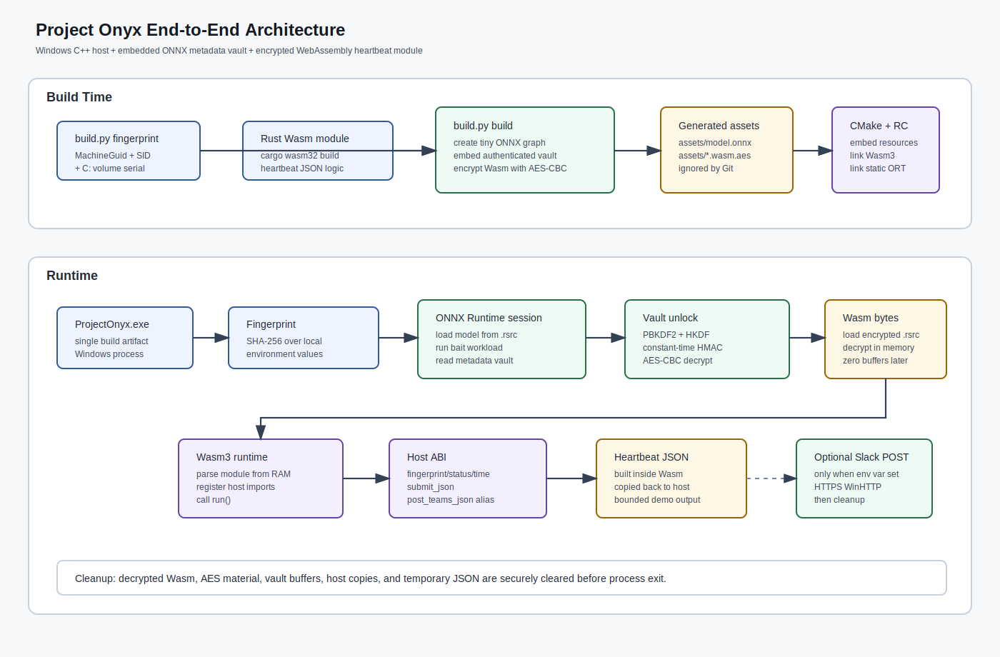

# Project Onyx Architecture

Project Onyx is a red team research PoC that demonstrates a layered runtime
composition pattern:

1. derive a local Windows environment fingerprint
2. load a small embedded ONNX model from the executable resource section
3. run a real ONNX Runtime workload as a benign bait computation
4. unlock authenticated metadata in the ONNX file with PBKDF2, HKDF, and HMAC
5. use the recovered demo key material to decrypt an embedded WebAssembly module in memory
6. execute the module through a minimal Wasm3 host interface
7. clear sensitive buffers before exit.

The demo payload is intentionally constrained to a heartbeat JSON. It is meant
for authorized lab validation, not for deployment against third-party systems.

## 1. Scope

The demo scope is intentionally limited. It does not implement persistence,
privilege escalation, credential access, lateral movement, command execution, or
destructive behavior. The WebAssembly module is only responsible for formatting a
heartbeat JSON from host-approved values as a simple PoC.

## 3. Build-Time Components

| Component | Responsibility | Output |
| --- | --- | --- |
| `build.py fingerprint` | Recreates the host fingerprint algorithm on Windows. | 64-character SHA-256 trigger. |
| `wasm_license_module` | Rust module that imports a small host ABI and formats heartbeat JSON as a simple PoC. | `wasm_license_module.wasm`. |
| `build.py build` | Creates a tiny ONNX bait graph, embeds an authenticated metadata vault, and encrypts the Wasm module. | `assets/model.onnx`, `assets/license_module.wasm.aes`. |
| `DiagnosticsTool.rc` | Embeds generated assets into the PE resource section. | `.rsrc` entries in the executable. |
| `CMakeLists.txt` | Links the C++ host, Wasm3, Windows libraries, and static ONNX Runtime component libraries. | `build/Release/ProjectOnyx.exe`. |

## 4. Runtime Components

| Component | Location | Responsibility |
| --- | --- | --- |
| Native host | `DiagnosticsTool.cpp` | Fingerprint collection, resource loading, ONNX Runtime session creation, key derivation, AES-CBC decrypt, Wasm3 runtime lifecycle, optional Slack/Teams POST, cleanup. |
| ONNX bait/vault | PE `.rsrc` | Valid ONNX graph plus authenticated metadata fields used by the host to unlock demo key material. |
| Encrypted Wasm | PE `.rsrc` | AES-256-CBC encrypted WebAssembly bytes. |
| Wasm3 runtime | Linked C sources | Parses and executes decrypted Wasm bytes in memory. |
| Wasm module | Decrypted in RAM | Reads host-provided values and formats heartbeat JSON. |
| Host ABI | Native functions exposed to Wasm | Provides controlled access to fingerprint, status, timestamp, JSON submission, and optional Slack/Teams POST trigger. |
| All in final monolithic .exe file |

## 5. Runtime Sequence

1. The process starts from `main()` in the native host.
2. The host reads non-admin environment identifiers: MachineGuid, current user SID from the process token, and the C: volume serial.
3. The host builds a normalized string and hashes it with SHA-256 to produce the environment fingerprint.
4. The host loads `assets/model.onnx` from the executable resource section into memory.
5. ONNX Runtime creates an in-memory session from the model buffer.
6. The host runs the small ONNX bait workload using fingerprint-derived tensor input.
7. The host reads ONNX metadata fields: schema, KDF settings, trigger HMAC, vault IV, vault ciphertext, and vault HMAC.
8. PBKDF2-HMAC-SHA256 derives a master key from the fingerprint and metadata salt.
9. HKDF-SHA256 derives independent keys for vault encryption, vault MAC, and trigger MAC.
10. The host verifies the trigger HMAC in constant time.
11. The host verifies the vault ciphertext HMAC in constant time.
12. The host decrypts the metadata vault with AES-256-CBC and validates the `ONX1` magic prefix.
13. The recovered 32-character demo key material is normalized and validated.
14. The host loads `assets/license_module.wasm.aes` from the executable resource section.
15. The host derives the WebAssembly AES key as SHA-256 over the recovered key material.
16. The encrypted WebAssembly bytes are decrypted in memory with AES-256-CBC.
17. Wasm3 creates an environment, runtime, and module from the decrypted bytes.
18. The host registers the imported functions expected by the Wasm module.
19. The host copies approved host values into Wasm linear memory.
20. The host calls the Wasm `run()` export.
21. Wasm reads the copied fingerprint, status, and timestamp through the host ABI.
22. Wasm formats a heartbeat JSON document.
23. Wasm submits the JSON back to the host.
24. If `PROJECT_ONYX_SLACK_WEBHOOK_URL` is set, the host posts that JSON to Slack over HTTPS.
25. The host zeroes sensitive buffers, releases ONNX Runtime and Wasm3 handles, and exits.

## 6. Host Function ABI

| Import name | Direction | Purpose |
| --- | --- | --- |
| `host.get_fingerprint_ptr()` | Wasm -> host | Returns the Wasm-memory offset of the copied fingerprint string. |
| `host.get_fingerprint_len()` | Wasm -> host | Returns fingerprint string length. |
| `host.get_status_ptr()` | Wasm -> host | Returns status string offset. |
| `host.get_status_len()` | Wasm -> host | Returns status string length. |
| `host.get_timestamp_ptr()` | Wasm -> host | Returns timestamp string offset. |
| `host.get_timestamp_len()` | Wasm -> host | Returns timestamp string length. |
| `host.submit_json(ptr, len)` | Wasm -> host | Copies final JSON from Wasm memory into host state. |
| `host.post_teams_json(ptr, len)` | Wasm -> host | Compatibility ABI name; current host implementation posts to Slack when configured. |

## 7. Data and Trust Boundaries

- The native host owns OS access, Windows resource access, cryptography, ONNX Runtime, Wasm3 lifecycle, and outbound HTTPS.
- The Wasm module does not receive native pointers. Host values are copied into Wasm linear memory first.
- The ONNX metadata vault is authenticated before decryption. Wrong fingerprint input fails before WebAssembly execution.
- The webhook URL is operator-provided through environment variables.

## 8. Failure Behavior

| Failure | Expected behavior |
| --- | --- |
| Missing ONNX resource | Host exits with failure. |
| Wrong fingerprint | Trigger HMAC validation fails and execution stops before Wasm decrypt. |
| Tampered ONNX metadata | Vault HMAC validation fails and execution stops. |
| Wrong WebAssembly key material | AES decrypt or Wasm parse fails and execution stops. |
| Missing Slack/Teams webhook | Local heartbeat flow completes without network POST. |
| Blocked Slack/Teams network path | POST returns a failure status, but the process still cleans up and exits. |

```mermaid
flowchart LR
    A["Windows host process"] --> B["Collect MachineGuid, user SID, and C: volume serial"]
    B --> C["SHA-256 environment fingerprint"]
    C --> D["Embedded ONNX bait model from .rsrc"]
    D --> E["Authenticated metadata vault"]
    E --> F["PBKDF2 + HKDF + HMAC checks"]
    F --> G["32-char demo key material"]
    G --> H["Decrypt embedded WASM asset in RAM"]
    H --> I["Wasm3 runtime"]
    I --> J["Host functions"]
    J --> K["Heartbeat JSON produced by WASM"]
    K --> L["Optional Slack/Teams webhook POST"]
    L --> M["Secure zeroing and process exit"]
```

## 9. Verification Checklist

1. `python build.py fingerprint` prints the expected 64-character trigger.
2. `python build.py verify --trigger <hash> --model assets/model.onnx` unlocks the expected 32-character demo key.
3. `cmake --build build --config Release` produces `build/Release/ProjectOnyx.exe`.
4. `dumpbin /DEPENDENTS build/Release/ProjectOnyx.exe` does not list `onnxruntime.dll`.
5. Running the executable with no webhook environment variable exits with code `0`.